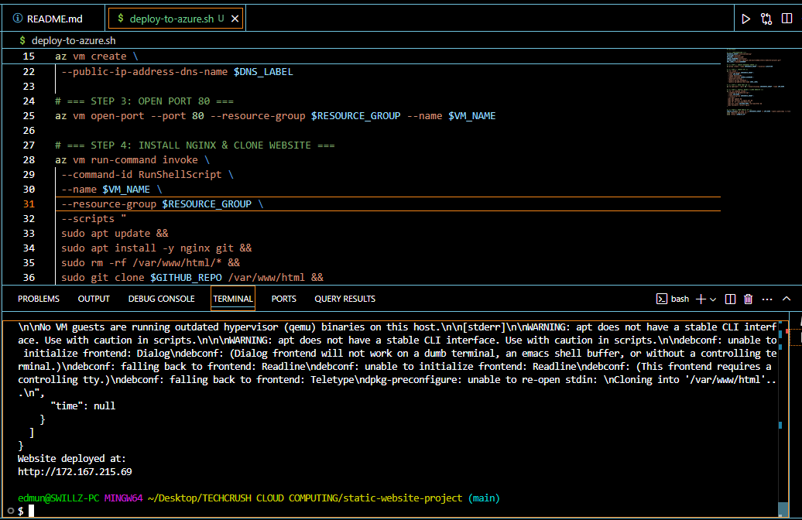

# Static Website Deployment on Azure

## Project Overview
This project demonstrates the deployment of a static HTML/CSS website for "Edmund's Website" using an Azure Virtual Machine and NGINX. The deployment was automated using a Bash script.

---

## Tech Stack
- Azure Virtual Machine (Ubuntu)
- NGINX Web Server
- GitHub for version control
- Bash script for automation

---

## Setup Steps

### 1. Create Static Website
- Built with basic HTML and CSS using VS Code

### 2. Push to GitHub
- Code is stored at: [GitHub Repo](https://github.com/swillzeddy/static-website-project)

### 3. Azure Deployment with Bash
- Script provisions:
  - Resource group
  - VM
  - NGINX setup
  - Pulls website from GitHub
- Run: `./deploy-to-azure.sh`

### 4. Access Site
Site is live at: http://172.167.215.69/

## Screenshots

### Live Site

### Azure VM

### Terminal Output

### GitHub Repo View
